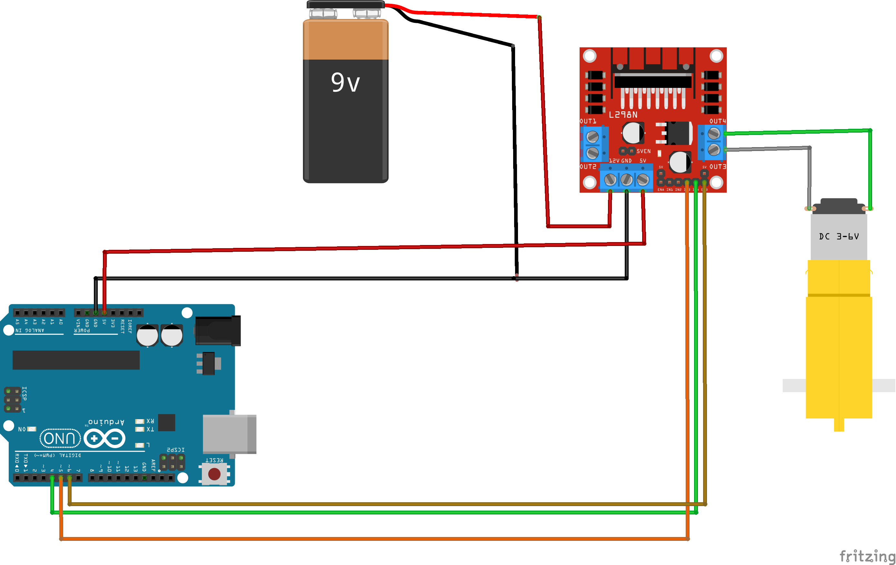
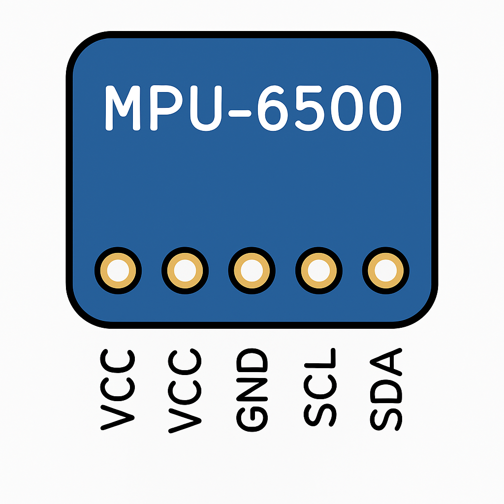

# Contenido
1. [Materiales](#materiales)
2. [Esquema de Conexión Motores con L298N](#esquema-de-conexión-motores-con-l298n)
3. [Código Funcionamiento Motores con L298N](#esquema-de-conexión-motores-con-l298n)
4. [Esquema de Conexión MPU6500](#esquema-de-conexión-mpu6500)
5. [Código con Arduino Usando MPU6500](#-ejemplo-de-código-básico-mpu6500)

## Materiales
- Arduino UNO R3
- Cable Largo USB para Arduino
- Cables Dupont (20) M-H.
- Cables Dupont (10) M-M.
- Sensor SR04.
- Sensor RGB.
- Sensor MPU6500.
- Driver L298N.
- Protoboard 170 puntos.
- Chasis (placa acrílico) básico con dos ruedas y rueda loca.
- Piezas para fijación de motor (2).
- Bateria 9V recargable.
- Broche Bateria 9V.
- Motores DC Amarillos (2).
- Servomotor SG90.
- Kit de tornillos.

## Esquema de Conexión Motores con L298N


### Conectando Arduino UNO + L298N + Motor DC
- Conectar los Pines IN1 a pin 9 (Arduino UNO), IN2 pin 10 (Arduino UNO), INA a pin 5 (PWM).
- GND es conectar al GND del Arduino.
- Vlógico es conectar 5V del Arduino.
- Salida Motor A, conectar el motor A que sería el motor derecho.
- Salida Motor B, conectar el motor B que sería el motor izquierdo.
- En Vin requiere de una fuente de alimentación externa, el cual puede ser una batería de 9 Voltios. 

## Esquema de conexión
| Módulo L298N | Arduino UNO | Descripción                                      |
|--------------|-------------|--------------------------------------------------|
| IN1          | D4          | Control del sentido de giro                     |
| IN2          | D5 (PWM)          | Control del sentido de giro                     |
| ENA          | D6 (PWM)   | Control de velocidad (puente si velocidad fija) |
| OUT1         | Motor A     | Terminal A del motor DC                         |
| OUT2         | Motor B     | Terminal B del motor DC                         |
| GND          | GND         | Tierra común con Arduino y fuente externa       |
| +12V         | Fuente +    | Alimentación del motor                          |
| 5V (opcional)| —           | Usar solo si el jumper está puesto              |

⚠️ **Importante**: Asegúrate de unir las tierras (GND) del Arduino y de la fuente externa.

## 🔌 Ejemplo de código usando L298N
```arduino
# Código de ejemplo en Python (simulado, normalmente usarías Arduino C++)
# En Arduino sería algo así:
void setup() {
  pinMode(4, OUTPUT); // IN1
  pinMode(5, OUTPUT); // IN2
  pinMode(6, OUTPUT); // ENA
}

void loop() {
  digitalWrite(4, HIGH);
  digitalWrite(5, LOW);
  analogWrite(6, 200); // Velocidad (0-255)
  delay(2000);

  digitalWrite(4, LOW);
  digitalWrite(5, HIGH);
  analogWrite(6, 200);
  delay(2000);
}
```
## Esquema de Conexión MPU6500



## Esquema de Conexión MPU6500

| Arduino Uno | MPU-6500 | Descripción          |
|:----------:|:--------:|:--------------------:|
| 5V        | VCC      | Alimentación (o +3.3V)   |
| GND       | GND      | Tierra               |
| A4        | SDA      | Datos I2C            |
| A5        | SCL      | Reloj I2C            |
| AD0       | GND      |  Tierra            |
### Explicación rápida
- - SDA (A4): Línea de datos.
- - SCL (A5): Línea de reloj.
- - Ambas líneas deben llevar una resistencia pull-up (normalmente ya vienen integradas en el módulo).
- - El GND debe estar común con el GND de Arduino.

## 🔌 Ejemplo de código básico MPU6500
```arduino 
#include <Wire.h>
#include <MPU9250_asukiaaa.h>

MPU9250_asukiaaa mpu;

void setup() {
  Serial.begin(115200);
  Wire.begin(21, 22);  // SDA = 27, SCL = 14

  mpu.setWire(&Wire);
  mpu.beginAccel();
  mpu.beginGyro();
  if (!mpu.accelUpdate() || !mpu.gyroUpdate()) {
    Serial.println("No se detecta el MPU-6500");
  } else {
    Serial.println("MPU-6500 detectado correctamente");
  }
}

void loop() {
  mpu.accelUpdate();
  mpu.gyroUpdate();

  Serial.print("Accel X: ");
  Serial.print(mpu.accelX());
  Serial.print(" | Gyro Z: ");
  Serial.println(mpu.gyroZ());

  delay(500);
}
```

## 🔌 Ejemplo de código usando MPU6500 y Filtrando la señal
```arduino
#include <Wire.h>
#include <MPU6050_light.h> // Compatible con MPU6500

MPU6050 mpu(Wire);

// Parámetros del filtro
#define N 10 // Número de muestras
float ax_buffer[N]; // Buffer para almacenar las últimas N lecturas
int index = 0;

void setup() {
  Serial.begin(9600);
  Wire.begin();
  
  mpu.begin();
  mpu.calcOffsets(); // Calibración
  
  // Inicializar buffer a cero
  for (int i = 0; i < N; i++) {
    ax_buffer[i] = 0;
  }
}

float filterAx(float new_value) {
  // Guardar nueva lectura
  ax_buffer[index] = new_value;
  index = (index + 1) % N;

  // Calcular promedio
  float sum = 0;
  for (int i = 0; i < N; i++) {
    sum += ax_buffer[i];
  }
  return sum / N;
}

void loop() {
  mpu.update();
  
  // Leer aceleración en X
  float ax = mpu.getAccX() * 9.81; // Convertir a m/s²
  
  // Aplicar filtro de media móvil
  float ax_filtrado = filterAx(ax);
  
  // Mostrar datos
  Serial.print("Aceleración cruda: ");
  Serial.print(ax, 2);
  Serial.print(" m/s²   |   Filtrada: ");
  Serial.print(ax_filtrado, 2);
  Serial.println(" m/s²");
  
  delay(50);
}
```
